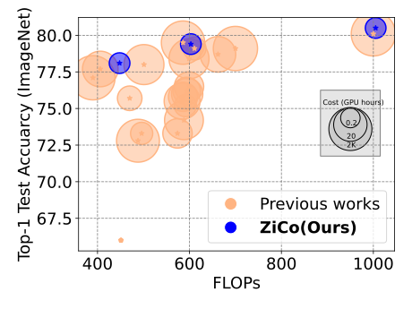

Official code for 'ZiCo: Zero-shot NAS via Inverse Coefficient of Variation on Gradients' (ICLR 2023 Spotlight) [Paper link](https://openreview.net/forum?id=rwo-ls5GqGn)


<div align="center">
    <a href="./">
        
    </a>
</div>


# Usage
Install the python environment; check `./environment.txt`
ZiCo-based searching for and train ImageNet models, with FLOPs budget from 450M to 1G:
``` bash
scripts/ZiCo_NAS_ImageNet_flops450M.sh
scripts/ZiCo_NAS_ImageNet_flops600M.sh
scripts/ZiCo_NAS_ImageNet_flops1G.sh
```

Params-based searching for and train ImageNet models, with FLOPs budget 450M:
``` bash
scripts/Params_NAS_ImageNet_flops450M
```

Download the checkpoints from the Anonymous google drive links:
https://drive.google.com/drive/folders/1DXhYUMvOmD7AjxGsGiUE5kYNa7t8tgPH?usp=sharing
Move all downloaded folders into the `./save_dir`
Evaluate the checkpoints ZiCo-based pretrained models, with FLOPs budget from 450M to 1G:
``` bash
python val.py --fp16 --gpu 0 --arch ZiCo_imagenet1k_flops450M_res224 --ckpt_path=./save_dir/ZiCo_NAS_ImageNet_flops450M/student_best-params_rank0.pth --data=$PATH_TO_IMAGENET
python val.py --fp16 --gpu 0 --arch ZiCo_imagenet1k_flops600M_res224 --ckpt_path=./save_dir/ZiCo_NAS_ImageNet_flops600M/student_best-params_rank0.pth --data=$PATH_TO_IMAGENET
python val.py --fp16 --gpu 0 --arch ZiCo_imagenet1k_flops1G_res224 --ckpt_path=./save_dir/ZiCo_NAS_ImageNet_flops1G/student_best-params_rank0.pth --data=$PATH_TO_IMAGENET
```

Evaluate the checkpoints Params-based pretrained models, with FLOPs budget 450M:
``` bash
python val.py --fp16 --gpu 0 --arch Params_imagenet1k_flops450M_res224 --ckpt_path=./save_dir/Param_imagenet1k_flops450M_res224/student_best-params_rank0.pth --data=$PATH_TO_IMAGENET
```

The code is modified on `https://github.com/idstcv/ZenNAS`

if you find our code useful, please consider citing our paper:
```
@inproceedings{
li2023zico,
title={ZiCo: Zero-shot {NAS} via inverse Coefficient of Variation on Gradients},
author={Guihong Li and Yuedong Yang and Kartikeya Bhardwaj and Radu Marculescu},
booktitle={The Eleventh International Conference on Learning Representations },
year={2023},
url={https://openreview.net/forum?id=rwo-ls5GqGn}
}
```
